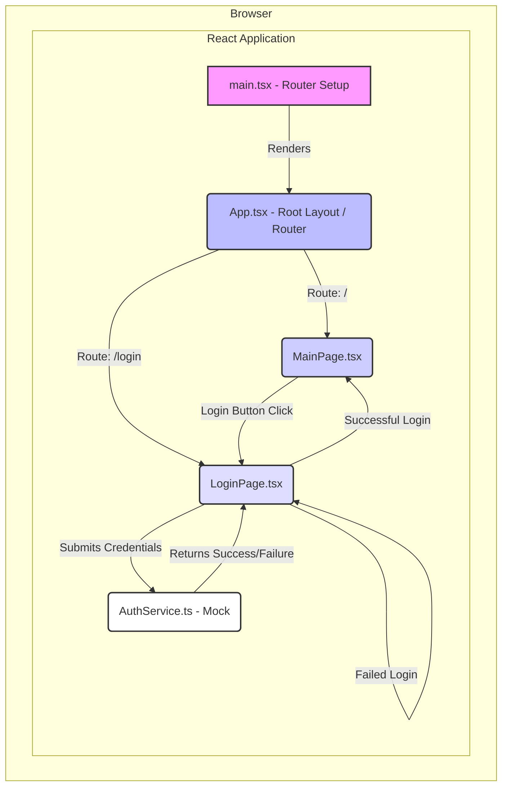

This document outlines the system architecture for integrating a client-side simulated login process into the existing React application. It details the component design, data architecture, technology choices, and considerations for scalability, security, and observability, strictly adhering to the provided specification and pseudocode.

## 1. Introduction

This architecture document specifies the design for the client-side login process, fulfilling the requirements outlined in the "Login Process Integration" specification. The primary goal is to add a login entry point and a simulated authentication flow within the existing React application, without involving a backend authentication system at this stage.

## 2. System Overview

The system design introduces a new client-side routing mechanism, a dedicated Login page, and a mock authentication service. Users will navigate from the main page to the login page, submit credentials to a client-side mock service, and be redirected based on the simulated authentication outcome. The entire flow is contained within the user's browser, leveraging the existing React/Vite frontend stack.

## 3. Component Design

The architecture introduces new components and a service within the existing React application, maintaining a clear separation of concerns.

### 3.1. Core Components and Responsibilities

*   **`main.tsx` (Application Entry Point / Router Setup)**
    *   **Responsibility:** Configures and renders the root React application, including setting up client-side routing using `react-router-dom`.
    *   **Boundary:** Top-level application orchestration.
    *   **Interface:** Consumes `BrowserRouter` and `Routes`/`Route` components from `react-router-dom`, rendering `App` component.

*   **`App.tsx` (Root Application Component / Layout)**
    *   **Responsibility:** Acts as the primary container for defining the application's overall layout and housing the routing logic that maps URLs to specific page components.
    *   **Boundary:** Encompasses all application pages.
    *   **Interface:** Renders `MainPage` and `LoginPage` components conditionally based on the current route.

*   **`MainPage` Component (New: `src/pages/MainPage.tsx`)**
    *   **Responsibility:** Renders the main content of the application, including a "Login" button. Handles navigation to the `/login` route upon button click.
    *   **Boundary:** Represents the application's home view.
    *   **Interface:** `onClick` handler for the login button, uses `useNavigate` from `react-router-dom`.

*   **`LoginPage` Component (New: `src/pages/LoginPage.tsx`)**
    *   **Responsibility:** Renders the login form, manages input state for username and password, handles form submission, interacts with the `AuthService` for authentication simulation, and displays error messages or triggers redirection.
    *   **Boundary:** Encapsulates all login-specific UI and logic.
    *   **Interface:**
        *   Input fields (`username`, `password`) with `onChange` handlers.
        *   Submit button with `onSubmit` handler.
        *   Displays `errorMessage` conditionally.
        *   Interacts with `AuthService.login(credentials: UserCredentials)`.
        *   Uses `useNavigate` for redirection.

*   **`AuthService` (New: `src/services/AuthService.ts`)**
    *   **Responsibility:** Provides a client-side mock implementation for authentication. It simulates network latency and validates hardcoded credentials ("test"/"password"). Returns a success or failure response.
    *   **Boundary:** Business logic layer for authentication, decoupled from UI.
    *   **Interface:**
        *   `login(credentials: UserCredentials): Promise<AuthSuccessResponse | AuthFailureResponse>`

### 3.2. Component Diagram



## 4. Data Architecture

Given the client-side mock nature of this feature, the data architecture is minimal and entirely in-memory within the browser. There is no persistent storage, database, or external data fetching involved.

### 4.1. Data Models (TypeScript Interfaces)

These interfaces define the structure of data exchanged within the client-side application and with the mock `AuthService`.

*   **`src/types/auth.d.ts`**
    ```typescript
    // UserCredentials for login input
    export interface UserCredentials {
        username: string;
        password: string;
    }

    // Response for successful authentication
    export interface AuthSuccessResponse {
        success: true;
        message: "Login successful";
        // token?: string; // Placeholder for future actual token
    }

    // Response for failed authentication
    export interface AuthFailureResponse {
        success: false;
        message: "Invalid username or password";
    }
    ```

### 4.2. Data Flow

1.  User inputs `username` and `password` into `LoginPage` fields. These values are stored in React component state.
2.  On form submission, a `UserCredentials` object is created from the state.
3.  This object is passed to `AuthService.login()`.
4.  `AuthService` processes the credentials in-memory and returns either an `AuthSuccessResponse` or `AuthFailureResponse`.
5.  `LoginPage` updates its UI (redirects or displays an error message) based on the received response.

## 5. Technology Stack

The technology stack is strictly defined by `CON-001` and `CON-004`.

*   **Frontend Framework:** React 19
*   **Language:** TypeScript 6
*   **Build Tool/Dev Server:** Vite 8
*   **Client-side Routing:** `react-router-dom` (New dependency, version `^6.x.x` recommended)
    *   **Justification:** `react-router-dom` is the de-facto standard for client-side routing in React applications. It provides robust, declarative routing capabilities essential for managing navigation between `/` and `/login` without full page reloads, aligning with FR-010 and enhancing user experience. It integrates seamlessly with React's component model.

## 6. Scalability, Security, and Observability

### 6.1. Scalability

*   **Current State (Mock Client-Side):** The current client-side implementation inherently scales well as it involves no server-side processing for authentication. The frontend application itself is a static asset, which can be efficiently distributed and cached by Content Delivery Networks (CDNs) to handle a massive number of concurrent users.
*   **Future Considerations:** When a real backend authentication service is introduced, its scalability will become the primary concern. This architecture is designed to easily swap out the mock `AuthService` with an actual service making API calls, ensuring the frontend client remains highly scalable.

### 6.2. Security

*   **NFR-006 Adherence:**
    *   Password input fields use `type="password"`.
    *   No credentials or sensitive data are exposed in the URL parameters.
    *   The mock authentication logic does not store credentials in `localStorage` or `sessionStorage` in plain text.
*   **Limitations (due to current scope):**
    *   Credentials (`"test"`, `"password"`) are hardcoded in the client-side `AuthService`, which is acceptable as per `CON-002` but is a critical security vulnerability for a real application.
*   **Future Security Enhancements:**
    *   **Real Authentication:** Implementing TLS/SSL for all communications with a backend API.
    *   **Token Management:** Securely storing authentication tokens (e.g., using HttpOnly, Secure cookies or Web Workers for `localStorage`).
    *   **Server-Side Validation:** All authentication and authorization logic must reside on the server.
    *   **Input Validation:** Robust client-side and server-side validation against common attacks (e.g., XSS, SQL injection for future backend).
    *   **Rate Limiting:** Protect login endpoints from brute-force attacks.

### 6.3. Observability

*   **Logging:**
    *   **Development:** `console.log` statements can be used within `AuthService` and `LoginPage` to trace the flow of authentication attempts and responses.
    *   **Production (Future):** Integration with client-side logging services (e.g., Sentry, LogRocket) would be implemented to capture errors and user interactions.
*   **Monitoring:**
    *   **Performance:** NFR-001 (Main Page Load) and NFR-002 (Login Page Load) will be monitored using browser-based tools like Lighthouse. The simulated delay in `AuthService` helps in performance testing.
    *   **Application Health:** For this client-side mock, health monitoring is limited to successful rendering and functional correctness.
*   **Error Reporting:**
    *   **User Feedback:** `LoginPage` displays a user-friendly error message ("Invalid username or password") on authentication failure (FR-009).
    *   **Internal:** Developer console logs during development. Future: Automated error reporting to a centralized system (e.g., Sentry) for unhandled exceptions or critical client-side errors.

## 7. Deployment Architecture

The application will be deployed as a Single Page Application (SPA), leveraging a Content Delivery Network (CDN) for optimal performance and availability.

### 7.1. Deployment Model

1.  **Build Phase:** The `npm run build` command (powered by Vite) compiles the React/TypeScript source code into static HTML, CSS, and JavaScript bundles, along with any static assets (e.g., `favicon.svg`).
2.  **Deployment to CDN:** These static build artifacts are then uploaded to a CDN (e.g., CloudFront, Netlify, Vercel, or Firebase Hosting). The CDN caches these assets globally.
3.  **User Access:** When a user requests the application URL, the CDN serves the cached static files from a geographically close edge location, ensuring low latency.
4.  **Client-Side Routing:** `react-router-dom` handles all subsequent navigation within the application, updating the URL and rendering components without requiring full page reloads from the server. This means the CDN only serves `index.html` on the initial load or direct deep links.

### 7.2. Deployment Diagram

```
+---------------------+       +---------------------+
| Developer Workstation |       |  CI/CD Pipeline     |
| (Code, Git)         |------>| (Vite Build, Test)  |
+---------------------+       +----------|----------+
                                         | (Build Artifacts: .html, .js, .css, images)
                                         v
+-----------------------------------------------------+
|           Content Delivery Network (CDN)            |
| (e.g., CloudFront, Netlify, Vercel, Firebase Hosting) |
|                                                     |
| +-------------------------------------------------+ |
| |  Static Assets:                                 | |
| |  - index.html                                   | |
| |  - app.[hash].js (React App, Router, Auth Logic)| |
| |  - index.[hash].css                             | |
| |  - public/favicon.svg, icons.svg                | |
| +-------------------------------------------------+ |
+-----------------------------------------------------+
                             |
                             v
+---------------------+
| User's Web Browser  |
| (Accesses App)      |
+---------------------+
```

## 8. API Contracts (Client-Side Mock)

The `AuthService` provides a conceptual API contract for client-side authentication.

### `AuthService` (Mock Client-side)

This service will be implemented as a TypeScript class or a module, with a single public method.

*   **Path:** `src/services/AuthService.ts`

```typescript
// src/types/auth.d.ts (as defined in Data Architecture)
export interface UserCredentials {
    username: string;
    password: string;
}

export interface AuthSuccessResponse {
    success: true;
    message: "Login successful";
}

export interface AuthFailureResponse {
    success: false;
    message: "Invalid username or password";
}

// src/services/AuthService.ts
class AuthService {
    private MOCK_USERNAME = "test";
    private MOCK_PASSWORD = "password";
    private SIMULATED_DELAY_MS = 500; // Simulate network latency

    /**
     * Simulates a client-side login attempt.
     * @param credentials - User's input username and password.
     * @returns A promise that resolves to either a success or failure response.
     */
    public async login(
        credentials: UserCredentials
    ): Promise<AuthSuccessResponse | AuthFailureResponse> {
        return new Promise((resolve) => {
            setTimeout(() => {
                if (
                    credentials.username === this.MOCK_USERNAME &&
                    credentials.password === this.MOCK_PASSWORD
                ) {
                    resolve({ success: true, message: "Login successful" });
                } else {
                    resolve({ success: false, message: "Invalid username or password" });
                }
            }, this.SIMULATED_DELAY_MS);
        });
    }
}

export const authService = new AuthService();
```

## 9. Design for Failure and Future Considerations

While the current scope involves a client-side mock, the architecture lays the groundwork for a robust, production-ready system.

*   **Failure Modes (Current Mock):**
    *   **Invalid Credentials:** Handled by displaying an error message (FR-009). This is the primary "failure" scenario within the mock.
    *   **JavaScript Errors:** Standard browser error handling. Could be enhanced with React Error Boundaries for UI resilience.
    *   **Network Issues (Simulated):** The `SIMULATED_DELAY_MS` mimics network latency. A real network failure (e.g., user offline) would result in the request timing out or failing. The current `AuthService` mock does not explicitly handle network-level failures, but it is implicitly covered by the fact that no actual network call is made.

*   **Future Enhancements / Design for Resilience:**
    *   **Real Backend Integration:** The `AuthService` interface can remain the same, but its implementation would be updated to make actual HTTP requests to a backend API. This would involve:
        *   **HTTP Client:** Using `fetch` or a library like `axios`.
        *   **Error Handling:** Implementing retry mechanisms, circuit breakers for backend services, and robust handling of various HTTP status codes (e.g., 401, 403, 500).
        *   **Session/Token Management:** Securely storing authentication tokens (e.g., in HttpOnly cookies or `localStorage` with appropriate security measures).
    *   **Client-Side Validation:** Implement stricter validation rules (e.g., minimum password length, valid username characters) before calling the `AuthService` to provide immediate user feedback and reduce unnecessary calls.
    *   **Loading States:** Introduce a loading spinner or disable the submit button during an authentication attempt to prevent multiple submissions and improve UX.
    *   **Accessibility:** Further enhance `LoginPage` with `aria-live` regions for error messages and comprehensive keyboard navigation testing (NFR-004).
    *   **Styling/Theming:** Integrate with a design system for consistent UI across the application (Non-Goal in current scope).

This architecture provides a clean, maintainable, and extensible foundation for the login process, ready for future evolution towards a fully-fledged authentication system.