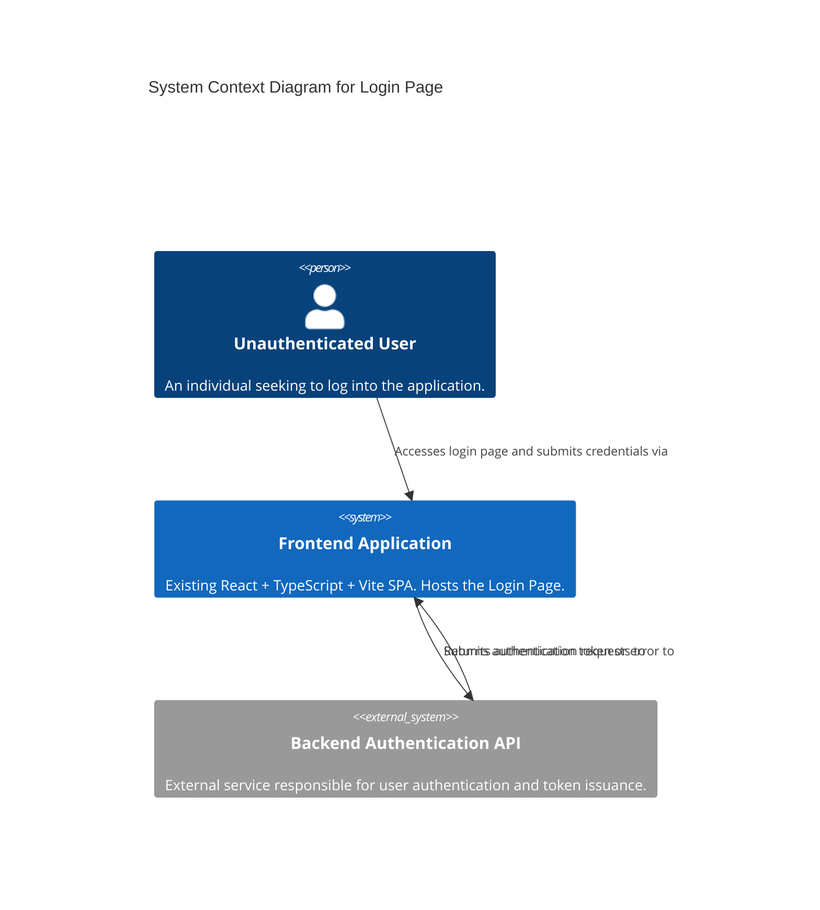

The following document outlines the system architecture for the new Login Page, transforming the provided specifications and pseudocode into a comprehensive design. It covers component definitions, data architecture, technology choices, scalability, security, observability, and deployment planning, emphasizing resilience and failure handling.

---

# System Architecture: Login Page Implementation

## 1. Introduction

This document details the architecture for integrating a new Login Page into an existing React + TypeScript + Vite application. The primary goal is to provide a secure, performant, and accessible user authentication mechanism that seamlessly integrates with the current frontend stack and consumes a separately managed backend authentication API.

## 2. System Context

The Login Page will be a new feature within an existing Single Page Application (SPA). It serves as the gateway for unauthenticated users to gain access to protected application resources. It interacts directly with the user and an external Backend Authentication API.



## 3. Component Design

This section defines the logical and physical components involved in the Login Page functionality, their responsibilities, and interfaces.

### 3.1. Logical Components

The system can be broken down into the following key logical components:

*   **Frontend Application Shell:** The overarching React application that manages routing and global layout.
*   **Router Module (`react-router-dom`):** Handles client-side navigation and routes requests to specific components.
*   **Header Component:** An existing component responsible for global navigation, now updated to include the login icon.
*   **Login Icon Component:** The existing `<button class="login-icon">` element, enhanced with navigation capabilities.
*   **Login Page Component (`<LoginPage />`):** The main UI component for user input, client-side validation, and interaction orchestration.
*   **Authentication Service (`AuthService`):** A dedicated module to abstract backend API communication and client-side token management.
*   **Validation Service (`ValidationService`):** A utility module for reusable input validation logic.
*   **Backend Authentication API:** An external, assumed-to-exist service that performs actual user credential verification and token issuance.

### 3.2. Component Responsibilities and Interfaces

#### 3.2.1. Frontend Application Shell

*   **Responsibilities:**
    *   Host the entire React application.
    *   Initialize the client-side router.
    *   Render global layout elements (e.g., `HeaderComponent`, `FooterComponent`).
*   **Interfaces:**
    *   **To Router Module:** Provides the root context for routing.
    *   **From Router Module:** Receives the component to render based on the current URL.

#### 3.2.2. Router Module (`react-router-dom`)

*   **Responsibilities:**
    *   Manage client-side routing, defining paths and their corresponding components.
    *   Redirect users to specified paths.
    *   Integrate with the `History` API for browser navigation.
*   **Interfaces:**
    *   **`/`:** Renders `<HomePageComponent />` (example).
    *   **`/login`:** Renders `<LoginPageComponent />` (FR-001).
    *   **`/dashboard`:** Renders `<DashboardPageComponent />` (FR-006, after successful login).
    *   **`NAVIGATE(path: string)`:** Function to programmatically change the URL.

#### 3.2.3. Header Component

*   **Responsibilities:**
    *   Display global navigation elements.
    *   Render the `Login Icon Component`.
*   **Interfaces:**
    *   **To Login Icon Component:** Passes a callback function (`NAVIGATE_TO_LOGIN_PAGE`) for navigation.

#### 3.2.4. Login Icon Component (`<button class="login-icon">`)

*   **Responsibilities:**
    *   Render the visual login icon.
    *   Upon click, trigger navigation to the `/login` path.
*   **Interfaces:**
    *   **`ON_CLICK` event:** Calls `NAVIGATE_TO_LOGIN_PAGE()` from the Router Module.

#### 3.2.5. Login Page Component (`<LoginPage />`)

*   **Responsibilities:**
    *   Render the email and password input fields and the "Log In" button (FR-002, FR-003, FR-004).
    *   Manage local state for input values, validation errors, and submission status.
    *   Perform client-side email and password validation (FR-009, FR-010).
    *   Enable/disable the "Log In" button based on form validity (FR-004).
    *   Orchestrate the authentication request via `AuthService` (FR-005).
    *   Display appropriate error messages for failed login attempts (FR-007, FR-008).
    *   Redirect to `/dashboard` on successful login (FR-006).
    *   Ensure accessibility (NFR-004, NFR-005).
*   **Interfaces:**
    *   **Input fields:** `email: string`, `password: string`
    *   **`ON_SUBMIT` event:** Triggers `HANDLE_LOGIN_SUBMIT` (calling `AuthService.LOGIN`).
    *   **From `AuthService`:** Receives `AuthResponse` for login status.
    *   **To Router Module:** Calls `NAVIGATE("/dashboard")` on success.

#### 3.2.6. Authentication Service (`AuthService`)

*   **Responsibilities:**
    *   Encapsulate the logic for making HTTP POST requests to the `/api/login` endpoint.
    *   Handle API response parsing and error mapping (e.g., 401 -> "Invalid credentials", 5xx -> "Unexpected error").
    *   Securely store the authentication token in `localStorage` upon successful login (FR-006, C-006).
    *   Provide utilities for checking authentication status and retrieving/removing tokens.
*   **Interfaces:**
    *   **`LOGIN(credentials: UserCredentials)`:**
        *   **Request:** `POST /api/login` with `UserCredentials` in JSON body.
        *   **Response:** `AuthResponse` object.
    *   **`SET_LOCAL_STORAGE_ITEM(key: string, value: string)`:** Stores data in browser's local storage.
    *   **`GET_LOCAL_STORAGE_ITEM(key: string)`:** Retrieves data from browser's local storage.
    *   **`IS_AUTHENTICATED()`:** Checks for presence of `authToken`.

#### 3.2.7. Validation Service (`ValidationService`)

*   **Responsibilities:**
    *   Provide reusable, stateless functions for common validation tasks.
    *   Implement specific validation rules, such as email format regex.
*   **Interfaces:**
    *   **`IS_VALID_EMAIL_FORMAT(email: string)`:** Returns `boolean`.

#### 3.2.8. Backend Authentication API

*   **Responsibilities:**
    *   Receive authentication requests.
    *   Verify user credentials against a user database.
    *   Generate and issue a secure authentication token (e.g., JWT) upon successful verification.
    *   Return appropriate HTTP status codes and error messages for various scenarios (e.g., 200 OK, 401 Unauthorized, 400 Bad Request, 500 Internal Server Error).
*   **Interfaces (API Contract):**
    *   **Endpoint:** `/api/login`
    *   **Method:** `POST`
    *   **Request Headers:** `Content-Type: application/json`
    *   **Request Body (`UserCredentials`):**
        ```json
        {
          "email": "string",
          "password": "string"
        }
        ```
    *   **Response (200 OK - Successful Authentication):**
        ```json
        {
          "token": "string", // JWT or similar
          "message": "Login successful"
        }
        ```
    *   **Response (401 Unauthorized - Invalid Credentials):**
        ```json
        {
          "message": "Invalid email or password."
        }
        ```
    *   **Response (400 Bad Request - Client-side validation bypass/Malformed request):**
        ```json
        {
          "message": "Bad Request: Email or password format invalid."
        }
        ```
    *   **Response (500 Internal Server Error - Server-side issue):**
        ```json
        {
          "message": "An unexpected error occurred. Please try again later."
        }
        ```

### 3.3. Component Diagram

```mermaid
C4Container
    title Container Diagram for Login Page Feature
    System_Ext(user, "Unauthenticated User", "Person")

    Container(spa_browser, "Frontend SPA (Browser)", "React, TypeScript, Vite", "Runs in user's web browser.") {
        Component(router, "Router Module", "react-router-dom", "Manages client-side navigation.")
        Component(header_comp, "Header Component", "React Component", "Contains global navigation and login icon.")
        Component(login_icon, "Login Icon", "React Button", "Triggers navigation to login page.")
        Component(login_page, "Login Page Component", "React Component", "Displays login form, handles input, validation, and API calls.")
        Component(auth_service, "Authentication Service", "TypeScript Module", "Abstracts login API calls and token storage.")
        Component(validation_service, "Validation Service", "TypeScript Module", "Provides reusable input validation logic.")
        Component(local_storage, "localStorage", "Browser API", "Securely stores authentication token.")
    }

    Container_Ext(backend_api, "Backend Authentication API", "HTTP/JSON API", "Authenticates users and issues tokens.")

    Rel(user, router, "Navigates to /login via")
    Rel(user, login_page, "Interacts with")
    Rel(header_comp, login_icon, "Renders")
    Rel(login_icon, router, "Navigates to /login using")
    Rel(router, login_page, "Renders")
    Rel(login_page, validation_service, "Uses for client-side validation")
    Rel(login_page, auth_service, "Submits credentials to")
    Rel(auth_service, local_storage, "Stores/Retrieves auth token from")
    Rel(auth_service, backend_api, "Sends POST /api/login (HTTPS)")
    Rel(backend_api, auth_service, "Returns token or error")
    Rel(auth_service, login_page, "Notifies of login status")

    UpdateLayoutConfig($c4ShapeInRow="2")
```

## 4. Data Architecture

### 4.1. Frontend Data Models

#### `UserCredentials` Interface

*   **Purpose:** Represents the data sent from the login form to the backend.
*   **Definition:**
    ```typescript
    interface UserCredentials {
      email: string;  // Max 254 characters
      password: string; // Min 8, Max 64 characters
    }
    ```

#### `AuthToken` Interface

*   **Purpose:** Represents the authentication token received from the backend upon successful login.
*   **Definition:**
    ```typescript
    interface AuthToken {
      token: string; // The actual JWT or session token string
    }
    ```

#### `AuthResponse` Interface

*   **Purpose:** Represents the structured response from the `AuthService.LOGIN` call.
*   **Definition:**
    ```typescript
    interface AuthResponse {
      success: boolean;
      token: string | null;
      status: number; // HTTP status code
      message: string | null;
    }
    ```

### 4.2. Client-Side Storage

*   **Mechanism:** `localStorage` (as per C-006).
*   **Key:** `authToken`
*   **Value:** `string` (The raw `AuthToken.token` string).
*   **Purpose:** To persist the user's authentication state across browser sessions.

### 4.3. Caching Layers

*   **Browser HTTP Caching:** The frontend application's static assets (HTML, CSS, JavaScript bundles, images) will leverage standard HTTP caching mechanisms (e.g., `Cache-Control` headers) configured at the web server/CDN level. This is critical for meeting NFR-001 (subsequent page load time).
*   **Client-Side Data Caching:** For the Login Page, `localStorage` acts as a simple cache for the `authToken`. No complex client-side state management (like Redux/Zustand) is strictly required for this component's specific needs, but the existing application might use one.

## 5. Technology Stack

The technology stack is primarily dictated by the existing application (C-001).

*   **Frontend Core:**
    *   **React (v19.2.6):** Component-based UI library. (C-001)
    *   **TypeScript (~6.0.2):** Statically typed JavaScript, enhancing maintainability and catching errors early. (C-001)
    *   **Vite (8.0.12):** Fast development build tool and bundler. (C-001)
*   **Routing:**
    *   **`react-router-dom` (latest compatible version):** Industry-standard library for client-side routing in React applications. (C-005)
*   **API Communication:**
    *   **Native `fetch` API:** Used within `AuthService` for HTTP requests. It's a modern, promise-based API native to browsers, avoiding external dependencies for simple HTTP calls.
*   **Styling:**
    *   **Existing CSS (`src/App.css`, `src/index.css`):** Adhering to NFR-003 and C-003, all UI elements will reuse existing styles. Component-scoped CSS Modules or styled-components could be introduced for specific Login Page layout if needed, but only if they integrate with existing design tokens.
*   **Tooling:**
    *   **ESLint:** For code quality and adherence to best practices. (NFR-007)
    *   **Prettier:** For consistent code formatting. (NFR-007, often used with ESLint)

## 6. Scalability

The Login Page implementation itself, as a frontend component, is highly scalable by its nature.

*   **Frontend Scalability:**
    *   **Static Asset Hosting:** The React application bundles are static files. These can be served globally via a Content Delivery Network (CDN), providing low-latency access to users worldwide. This inherently scales to millions of users as traffic patterns are typically handled by the CDN infrastructure.
    *   **Client-Side Processing:** All rendering, validation, and state management logic for the Login Page component occurs on the user's browser, offloading computation from servers.
*   **Backend Dependency:** The overall scalability of the login *process* heavily relies on the Backend Authentication API. It is assumed that the backend service is designed for horizontal scaling, capable of handling concurrent authentication requests efficiently. The frontend design is agnostic to backend scaling mechanisms.

## 7. Security

Security is paramount for an authentication component.

*   **Credential Transmission (NFR-006):**
    *   All communication between the frontend and the Backend Authentication API *must* occur over **HTTPS/TLS**. This encrypts credentials (email, password) and tokens in transit, protecting against eavesdropping and Man-in-the-Middle attacks. This is a deployment and backend configuration concern.
*   **Client-Side Validation:**
    *   Frontend validation (FR-009, FR-010) is for user experience and reducing unnecessary backend load, **not for security**. All validation rules must be strictly enforced on the server-side as well.
*   **Authentication Token Storage (C-006):**
    *   The authentication token will be stored in `localStorage`.
    *   **Risk:** `localStorage` is vulnerable to Cross-Site Scripting (XSS) attacks. If an attacker can inject malicious JavaScript into the page, they can steal the token from `localStorage`.
    *   **Mitigation:**
        *   **Strict Content Security Policy (CSP):** Implement a robust CSP to prevent the execution of unauthorized scripts, thereby reducing XSS risk.
        *   **Input Sanitization:** Ensure all user-generated content displayed on the site is properly sanitized to prevent XSS injection points.
        *   **Short-lived Tokens:** Issue tokens with short expiration times and use refresh tokens (if applicable, though out of scope for this spec) to limit the window of exposure.
        *   **Server-Side Token Invalidation:** Backend should have mechanisms to invalidate compromised tokens.
        *   **HttpOnly Cookies (Preferred for Production):** While `localStorage` is specified for this task (C-006), for production-grade security, `HttpOnly` cookies are generally preferred for storing tokens/session IDs because they are inaccessible to client-side JavaScript, mitigating XSS risks. This would require backend cooperation to set and manage these cookies.
*   **Backend Security (Assumed):**
    *   **Password Hashing:** Backend must store passwords using strong, one-way hashing algorithms (e.g., bcrypt) with salts.
    *   **Rate Limiting:** The backend API should implement rate limiting on the `/api/login` endpoint to prevent brute-force attacks.
    *   **Account Lockout:** Implement account lockout policies after multiple failed login attempts.
    *   **Input Validation:** Backend must rigorously validate all incoming data to prevent injection attacks (SQL injection, NoSQL injection, etc.).
    *   **CORS (Cross-Origin Resource Sharing):** The backend API must be configured to correctly manage CORS headers, allowing requests only from authorized frontend origins.

## 8. Observability

To ensure the Login Page performs reliably and provides a good user experience, robust observability mechanisms will be put in place.

*   **Logging:**
    *   **Client-Side Logging:**
        *   Informative logs for component lifecycle, user interactions, and successful API calls will be sent to the browser console during development.
        *   In production, a structured logging library (e.g., a lightweight custom logger) will be used to send critical events (e.g., API errors, token storage failures) to a centralized logging platform (e.g., CloudWatch, Splunk, ELK stack).
    *   **Error Logging:**
        *   All `catch` blocks in `AuthService` and `LoginPage` will log detailed error information (stack traces, request payloads - omitting sensitive data, response status) to aid in debugging.
*   **Metrics & Performance Monitoring:**
    *   **Performance Targets (NFR-001, NFR-002, PT-001, PT-002, PT-003):**
        *   **Page Load Time (Time to Interactive):** Tracked using Web Vitals (LCP, FID, CLS) via browser performance APIs or dedicated RUM (Real User Monitoring) tools (e.g., Google Analytics, Datadog RUM, New Relic Browser).
        *   **Login Latency (API Response Time):** Custom metrics will be implemented within `AuthService` to measure the duration of `fetch` calls to `/api/login` (from request initiation to response receipt). These metrics will be pushed to a monitoring system (e.g., Prometheus, Grafana).
    *   **Success Metrics (SM-001, SM-002, SM-003):**
        *   **Login Success Rate, Completion Rate, Error Rate (Unexpected):** Custom events will be sent to an analytics platform (e.g., Google Analytics, PostHog) to track these business-critical metrics. This involves tracking login button clicks, successful token storage, and various error conditions.
    *   **Frontend Bundle Size (PT-004):** Automated build pipeline checks will monitor the JavaScript bundle size, alerting if the increase exceeds the target, using tools like Webpack Bundle Analyzer or similar Vite plugins.
*   **Error Reporting:**
    *   **Centralized Error Tracking:** An error tracking service (e.g., Sentry, Bugsnag) will be integrated to capture unhandled JavaScript exceptions, API errors, and network failures in the frontend. This provides real-time alerts and detailed context for debugging production issues.

## 9. Deployment Architecture

The frontend application, including the Login Page, will be deployed as static assets.

### 9.1. Overview

The React + TypeScript + Vite application builds into a set of static HTML, CSS, and JavaScript files. These files are then deployed to a static content hosting service, typically backed by a CDN. The communication to the Backend Authentication API happens directly from the user's browser over HTTPS.

1.  **Development:** Developers work on the React application locally using Vite's development server.
2.  **Build:** Upon merging code to the main branch (or trigger), a CI/CD pipeline builds the application (`npm run build`). This compiles TypeScript, bundles JavaScript, processes CSS, and generates optimized static assets.
3.  **Deployment:** The generated static assets are uploaded to a static file hosting service (e.g., AWS S3 + CloudFront, Netlify, Vercel, Firebase Hosting).
4.  **CDN Distribution:** A Content Delivery Network (CDN) is used to cache these assets globally, reducing latency and improving page load times for users (NFR-001).
5.  **User Access:** Users access the application via a domain (e.g., `https://www.yourapp.com`). The CDN serves the static files to their browser.
6.  **API Interaction:** The browser makes API calls to `https://your-api-domain.com/api/login` (the Backend Authentication API).

### 9.2. Deployment Architecture Diagram

```mermaid
C4Deployment
    title Deployment View for Login Page Feature
    Deployment_Node(user_device, "User Device", "Web Browser (Chrome, Firefox, Safari)", "Laptop, Mobile Phone") {
        Component(frontend_app_instance, "Frontend App Instance", "React SPA", "Runs in browser, displays Login Page.")
    }

    Deployment_Node(cdn, "CDN (Content Delivery Network)", "Cloudflare, AWS CloudFront, etc.", "Globally distributed edge servers for static content.") {
        Component(static_assets, "Static Assets", "HTML, CSS, JS bundles", "Cached copies of the built React app.")
    }

    Deployment_Node(frontend_hosting, "Frontend Hosting", "AWS S3, Netlify, Vercel, etc.", "Origin server for static assets.")

    Deployment_Node(api_gateway, "API Gateway", "AWS API Gateway, Nginx, etc.", "Entry point for backend services.") {
        Deployment_Node(backend_auth_cluster, "Backend Auth API Cluster", "Node.js/Python/Java, Database", "Scalable backend microservice for authentication.")
    }

    Rel(user_device, cdn, "1. Request static assets (HTTPS)")
    Rel(cdn, frontend_hosting, "2. Fetch static assets (if not cached)")
    Rel(frontend_hosting, cdn, "3. Serve static assets")

    Rel(frontend_app_instance, api_gateway, "4. Make /api/login POST request (HTTPS)")
    Rel(api_gateway, backend_auth_cluster, "5. Route to authentication service (Internal Network)")
    Rel(backend_auth_cluster, api_gateway, "6. Return auth token/error")
    Rel(api_gateway, frontend_app_instance, "7. Return auth token/error (HTTPS)")

    UpdateLayoutConfig($c4ShapeInRow="2")
```

## 10. Design for Failure

Anticipating and planning for component failures is crucial for a resilient system.

*   **Backend Authentication API Unavailability / Errors:**
    *   **Failure Mode:** The `/api/login` endpoint is down, unresponsive, or returns unexpected 5xx errors.
    *   **Impact:** Users cannot log in.
    *   **Mitigation:**
        *   **Graceful Degradation (FR-008):** The `AuthService` will catch network errors or 5xx HTTP responses and propagate a generic error message ("An unexpected error occurred. Please try again later.") to the `LoginPage`.
        *   **Retry Mechanism:** The "Log In" button will be re-enabled after an error, allowing users to manually retry.
        *   **Observability:** Robust logging and error reporting (Section 8) will alert operations teams to backend issues for quick resolution.
*   **Network Issues (Client-Side):**
    *   **Failure Mode:** User's internet connection drops or experiences high latency during the login attempt.
    *   **Impact:** Login request fails or times out.
    *   **Mitigation:**
        *   **`fetch` API Error Handling:** The `catch` block in `AuthService.LOGIN` explicitly handles network errors, displaying the generic error message (FR-008).
        *   **Loading State:** The `isSubmitting` state in `LoginPage` provides visual feedback ("Logging In...") to the user during the request, indicating that the system is trying to process the request and not just stuck.
*   **Client-Side Storage (`localStorage`) Failure:**
    *   **Failure Mode:** Browser security settings or storage quota issues prevent `localStorage.setItem` from succeeding.
    *   **Impact:** User successfully authenticates with the backend, but the token cannot be stored locally, preventing subsequent authenticated access and redirection (FR-006 failure).
    *   **Mitigation:**
        *   **Error Handling:** `AuthService.SET_LOCAL_STORAGE_ITEM` will wrap `localStorage` calls in a `try...catch` block to handle potential `SecurityError` or `QuotaExceededError` exceptions. If storage fails, log a critical error and inform the user to try again or check browser settings. The user would remain on the login page.
        *   **Redirection Guard:** On `/dashboard`, a check for the presence of `authToken` should exist. If it's missing, redirect to `/login`.
*   **Client-Side Rendering Errors (Unexpected JavaScript Errors):**
    *   **Failure Mode:** A bug in the `LoginPage` component or its dependencies causes an unhandled JavaScript error.
    *   **Impact:** The page crashes, becomes unresponsive, or displays incorrectly.
    *   **Mitigation:**
        *   **Error Boundaries:** Implement React Error Boundaries at strategic points in the component tree (e.g., around the `LoginPage` component) to gracefully catch rendering errors and display a fallback UI instead of crashing the entire application.
        *   **Centralized Error Reporting:** As per Section 8, Sentry or similar tools will capture these errors for analysis.
*   **Malicious Inputs (XSS, Injection attempts):**
    *   **Failure Mode:** An attacker attempts to inject malicious script into input fields or manipulate the authentication flow.
    *   **Impact:** Data compromise, session hijacking, or system instability.
    *   **Mitigation:**
        *   **Strict Client-Side Validation:** While not a security boundary, it prevents obvious attacks.
        *   **Backend Server-Side Validation:** Crucial for security, backend must sanitize and validate all inputs rigorously.
        *   **HTTPS/TLS (NFR-006):** Encrypts data in transit.
        *   **Content Security Policy (CSP):** Prevents loading unauthorized scripts or resources, mitigating XSS.
        *   **HttpOnly Cookies (Recommended):** If feasible, switching from `localStorage` to HttpOnly cookies for token storage reduces XSS attack surface (as discussed in Section 7).

By designing with these potential failures in mind, the Login Page will be more robust and resilient, providing a better and safer experience for users.